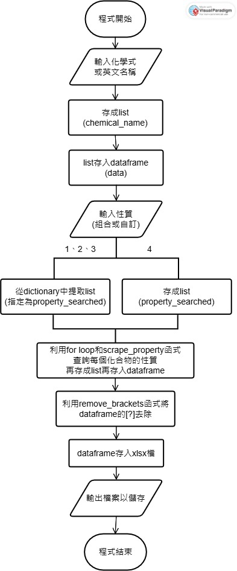

# 預報藥品查詢小幫手

## 開發者：化工一 B13504125 蘇姵安

程式檔案：mainprogram.py

## (1) 程式的功能

1. 使用者輸入藥品的化學式(chemical formula)或是化合物的英文名稱(IUPAC name)，再輸入欲查詢的藥品性質，可以選擇已經組合好的清單或自行指定性質。
2. 程式會在維基百科的對應網頁搜尋化合物的性質，並將其存入xlsx檔。
3. 使用者打開xlsx檔即可看到整理好的性質。

## (2) 使用方式

### 1. 環境設定

pip install openpyxl beautifulsoup4 requests pandas

註：如果不能一次下載四個，請分開下載。

### 2. 確認在能連上網的環境下執行程式

### 3. 依照程式的指示輸入化學式(chemical formula)或是英文名稱(IUPAC name)

兩種都可輸入，有些藥品能夠用化學式進到對應的維基百科頁面，用英文名稱不行；有些則能夠用英文名稱進到對應的頁面，用化學式不行。所以**建議輸入化學式**，因為比較節省時間。

以下為輸入的範例(粗體字為要輸入的內容)：

請輸入藥品的化學式(chemical formula)，若該藥品是水合物請去掉水合的部分(如SnCl2•2H2O請輸入SnCl2)
每行輸入一個化學式，輸入end結束：
**H2O**

**KNO3**

**Ca(OH)2**

**NaCl**

**end**

### 4. 依照程式的指示輸入欲查詢的性質組合

使用者根據要進行的實驗選擇組合好的性質清單(1-3)，如未涉及強烈溫度變化的碘鐘實驗就適合使用清單1，也可以輸入4自訂欲查詢的藥品性質，並以**小寫**輸入性質。

以下為輸入的範例(粗體字為要輸入的內容)：

藥品性質查詢組合

1(solubility):  IUPAC name + molar mass + solubility in water + appearance

2(m.p./b.p.):   IUPAC name + molar mass + m.p. + b.p. + appearance

3(1+2): IUPAC name + molar mass + solubility in water + m.p. + b.p. + appearance

4(customized)

輸入數字(1234)以選擇你想查詢的藥品性質：**4**

請以小寫輸入想查詢的化合物性質，每行一個性質，輸入end結束：

**iupac name**

**solubility**

**molar mass**

**end**

### 4. 等程式執行完畢後即可打開存好的檔案

當程式已執行完畢會print出 **資料已處理並儲存為 updated.xlsx** ，使用者即可打開updated.xlsx檔案查看藥品的性質。

## (3) 程式的架構

在此附上簡單易的流程圖

註：程式檔案中，程式碼後有附註。

## (4) 開發過程

### 1. 主題發想：
12/5之前：詢問chatGPT是否能夠利用PubChem提供的API查詢化合物性質

### 2. 分段撰寫程式與問題解決:
   
12/5之前：寫好存檔程式
   
12/5：

(1) 發現利用PubChem提供的API只能查詢IUPAC name和molar mass

      改成利用維基百科的API搜尋(失敗)
    
      改成利用網頁搜尋PubChem(失敗)
   
      改成利用網頁搜尋維基百科(成功)
   
      修改chatGPT提供的網頁搜尋程式
   
(2) 寫好利用forloop將性質存入csv檔的程式
   
12/23：
   
(1) 發現℃可在vscode預覽中顯示，但在csv檔中顯示亂碼
   
      詢問chatGPT後得知csv無法處理特殊字元，但xlsx可以
   
      改成讀入及存檔成xlsx檔
   
(2) 從維基百科搜尋到的資料後面會出現[]的標記
   
      使用chatGPT提供的程式
   
(3) 寫好使用者介面(輸入查詢性質)的程式
   

### 3. 組合程式、測試:

12/23

### 4. 優化程式:
12/23
   
(1) 改成從vscode介面輸入藥品化學式
   
(2) 修改使用者介面(輸入查詢性質)的程式
   

## (5) 參考資料來源

我沒有參考任何程式，只有問chatgpt相關的問題，以下附上我與chatgpt的對談連結。此外，程式檔案中我有附註此部分是chatGPT寫的、修改chatGPT的、還是完全自己寫的，也可參考README.md中(6)的說明。

對話連結：<https://chatgpt.com/share/676ae6b7-be64-800d-9750-81d978ac57e1>

## (6) 程式修改或增強的內容

### 修改自charGPT

1. scrape_property(chemical_name, property)
   
    (1) 詢問chatGPT得到scrape_property(chemical_name)，自己擴充成可以查詢各種property。
2. remove_brackets(text)
3. 輸出xlsx檔

### 完全是自己寫的部分

1. 程式架構
2. 使用者介面，包含輸入化合物、查詢清單的組合、存成list。
3. 用forloop將性質存入dataframe。

## (7) 程式的優點和未來的可開發性

### 優點：
1. **實用性高**：
    程式針對需要撰寫四年預報的化工系學生設計，使用者可以大幅減少撰寫預報時查詢藥品的時間。  
2. **客製化程度高**：
    選擇性質查詢組合(123)，能快速根據不同的實驗輸出所需的性質，此外使用者也可自訂想查詢的藥品性質，以輸出客製化的清單。

### 可開發性：
1. 改成以pubChem的網頁搜尋：
    嘗試過但失敗，有可能是因為pubChem網頁的HTML結構比較複雜，需要進一步研究。
2. 網頁的對應問題：
    有些化合物可用化學式直接搜尋到對應的維基百科網頁，但利用IUPAC名稱不行；有些化合物可用IUPAC名稱直接搜尋到對應的維基百科網頁，但利用化學式不行。我目前有想到一個方法是利用pubChem的API將輸入的化學式轉成CID(化合物的編碼)，再轉成IUPAC名稱進行搜尋，但找幾個化合物測試後，發現那些維基百科找不到的，利用pubChem的API也找不到，這是一個待解決的問題。

## (8)補充說明
1. 課本已經有藥品的中文名稱，故設計程式時就沒有考慮輸出中文名稱的部分。
2. 執行程式時請關閉已儲存好的檔案(updated.xlsx)。
